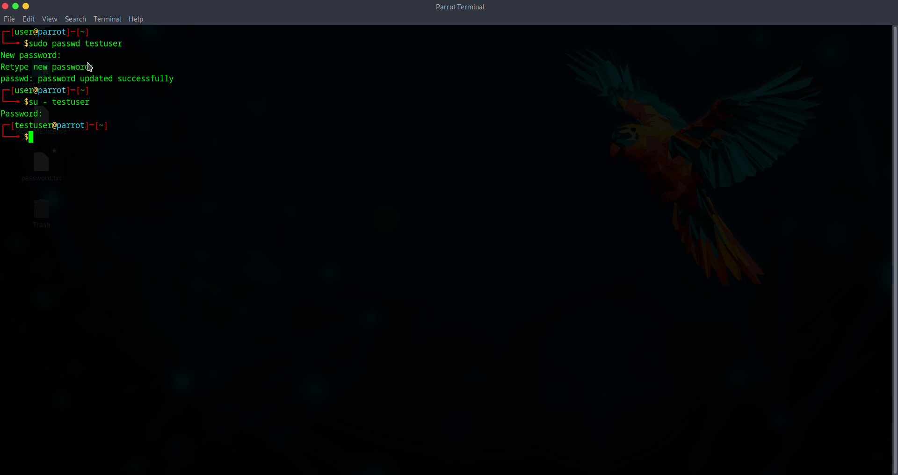

# Resetting a Linux User Password

**Problem:**  
User forgot their Linux account password.

**Environment:**  
Parrot OS VM (Linux)

**Steps Taken:**  
1. Reset password using `sudo passwd testuser`  
2. Verified login using `su - testuser`  

**Solution:**  
Password was successfully reset. User can now log in.

**Screenshot:**  

