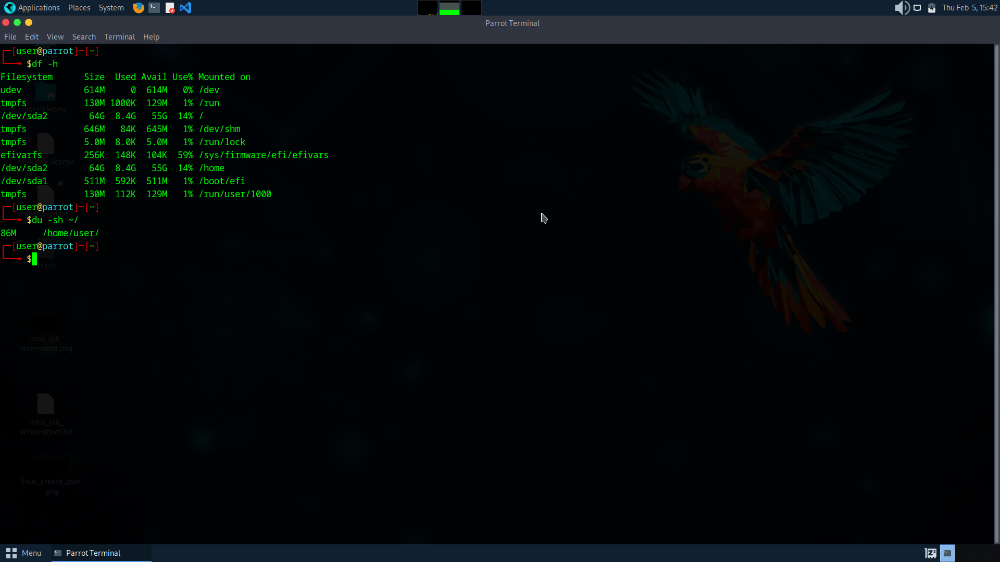

# Disk Usage Analysis and Cleanup

## Problem
System storage was running low and needed investigation.

## Environment
Parrot OS Virtual Machine

## Steps Taken
1. Checked disk usage using `df -h`
2. Checked home directory size using `du -sh ~/`
3. Cleared package cache using `sudo apt clean`
4. Verified available space

## Solution
Disk usage was analyzed and unnecessary cache files were removed.

## Screenshot

