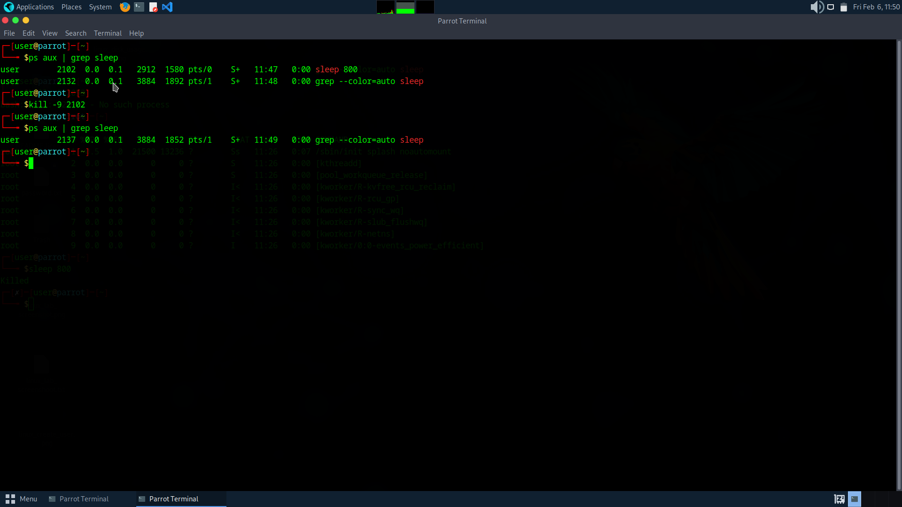

# Process Management in Linux

## Problem
A process was running and needed to be terminated safely.

## Environment
Parrot OS Virtual Machine

## Steps Taken
1. Listed processes using `ps aux | head`
2. Selected a harmless test process
3. Killed it using `kill -9 <PID>`
4. Verified termination

## Solution
Process was terminated successfully.

## Screenshot

